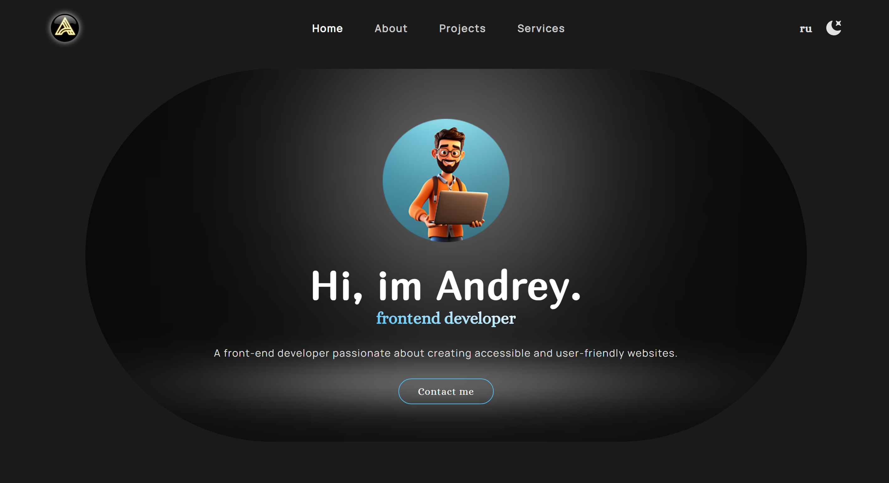
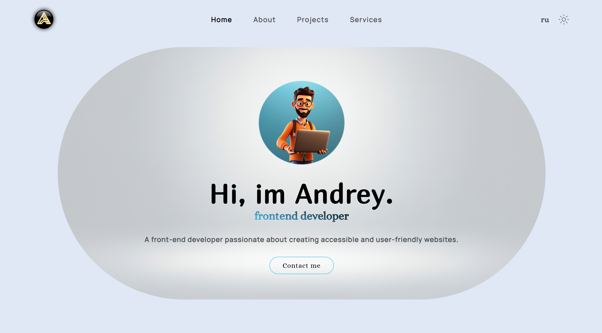
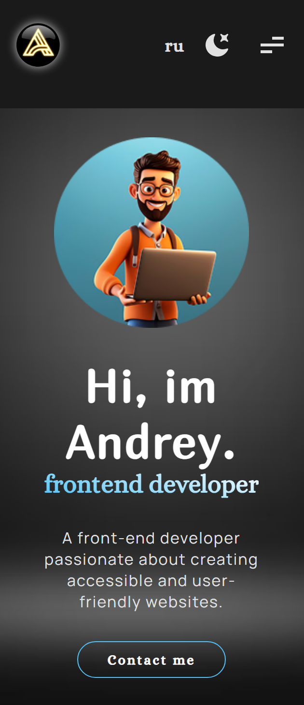

# Portfolio Website 🚀

Современный адаптивный сайт-портфолио с автоматизированной сборкой.

## 🛠 Технологический стек

- **Сборщик:** [Gulp](https://gulpjs.com/)
- **HTML:** Модульная структура через `gulp-file-include` (позволяет разделять код на header, footer и секции).
- **CSS:** Использование переменных, Flexbox и Grid. Автоматическая расстановка префиксов и минификация.
- **JS:** Сжатие и оптимизация через `terser`.
- **Images:** Автоматическая конвертация в формат **WebP** для быстрой загрузки и создание SVG-спрайтов.

* **Fonts:** Конвертация шрифтов в современный формат **WOFF2**.

## 📂 Структура проекта

- `src/` — исходные файлы для разработки (Styles, Images, JS, HTML-части).
- `docs/` — скомпилированная и оптимизированная версия сайта для публикации (GitHub Pages).

## 🚀 Как запустить проект локально

1. Склонируйте репозиторий:
   ```bash
   git clone [https://github.com/Qooler-667/portfolio-test.git](https://github.com/Qooler-667/portfolio-test.git)
   ```

## 📸 Скриншоты проекта

### Desktop (Dark Theme)



### Desktop (Light Theme)



### Mobile Version


